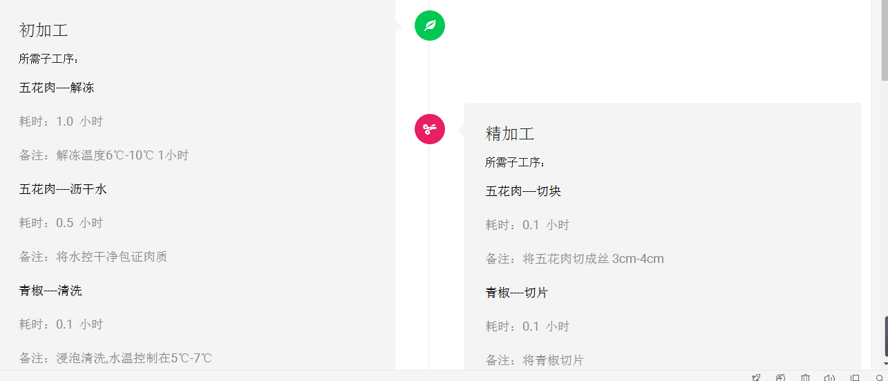

# CIM
餐饮工业化管理系统(Catering industrialization management)
## 项目简介
餐饮工业化管理系统是针对食品生产行业设计的一款专业生产管理软件.
## 系统模块
1.	研发系统
2.	订单系统
3.	信息计划系统 ★
4.	采购管理系统
5.	库存管理系统
6.	生产管理系统
7.	质量控制系统
8.	设备管理系统
9.	数据监控系统
10.	角色管理系统

## 技术选型

1、后端

* 核心框架：Spring Framework
* 视图框架：Spring MVC
* 持久层框架：MyBatis
* 日志管理：Log4j
* 工具类：Apache Commons、FastJson

2、前端

* JS框架：jQuery
* CSS框架：Bootstrap
* 客户端验证：JQuery-html5Validate
* 数据表格：jqGrid
* 树结构控件：jQuery zTree
* 日期控件： LayDate
* 图表控件：echarts

## 数据库结构图

## 页面展示

